# Multi-User Chat System with AI Integration

A real-time WebSocket-based chat system using FastAPI, SQLite, and event-driven architecture with shared conversations and mocked AI responses.

## Features

- **Real-time multi-user messaging** via WebSockets
- **Shared conversation history** - All users in a conversation see all messages and full history
- **Username-based persistence** - Users identified by username with auto-reconnect via localStorage
- **Event-driven architecture** - asyncio.Queue for async message pipeline
- **Mocked AI agent** - Intent-based responses for Python, async, WebSocket, event-driven, and database topics
- **SQLite persistence** - Full conversation history with user tracking
- **Auto-reconnect** - Users resume their session automatically when rejoining

## Setup

1. Create and activate the virtual environment:
```bash
python3.12 -m venv .venv
source .venv/bin/activate
```

2. Install dependencies with uv:
```bash
uv add fastapi uvicorn aiosqlite
```

3. Start the server:
```bash
uv run server.py
```

The WebSocket server will start on `ws://localhost:8765/ws`
The Frontend client page is served on `http://localhost:8765/`

### Database Initialization

The SQLite database is **created automatically on first run**. Database files (`.db`, `.sqlite`, etc.) are not committed to the repository - each developer gets a fresh database for their local environment. This ensures:

- **Clean development environment** - No stale data from other developers
- **Schema consistency** - Database is initialized with the latest schema
- **Test isolation** - Each test run can start with a clean slate
- **No merge conflicts** - Database state doesn't create git conflicts

When you first run `server.py`, it will automatically create the `chat_history.db` file if it doesn't exist.

## Usage

1. Open `client.html` directly in your browser (file:// protocol) or open http://localhost:8765/
2. Enter a username and join the chat
3. All users see each other's messages in real-time
4. View full conversation history from all users
5. Send regular messages or ask `/AIBot <question>` for AI responses

**AI Bot Examples:**
- `/AIBot What is Python?` - Get Python-specific information
- `/AIBot How does async work?` - Learn about asynchronous programming
- `/AIBot Explain WebSockets` - Understand WebSocket communication
- `/AIBot What is event-driven architecture?` - Learn about event systems
- `/AIBot Tell me about databases` - Get database information

## Architecture

### Directory Structure

```
server.py                    # Main entry point with FastAPI app and lifespan
├── domain/
│   ├── constants.py        # Type aliases and constants (MESSAGE_TYPE_*, EVENT_TYPE_*)
│   └── models.py           # Domain models: User, Message, and event dataclasses
├── database/
│   └── chat_database.py    # SQLite persistence layer
├── events/
│   └── publisher.py        # EventPublisher, EventConsumer, AIEventConsumer
├── ai/
│   └── agent.py            # MockedAIAgent with intent detection
└── websocket/
    └── handler.py          # WebSocket protocol handling and message parsing
```

### Domain Models

**Core Models (dataclasses with type safety):**
- `User` - user_id, username
- `Message` - sender_id, sender, text, msg_type, conversation_id
- `UserMessageEvent` - type, user_id, sender, text, sender_ws
- `AIRequestEvent` - type, user_id, sender, text, sender_ws
- `AIResponseEvent` - type, text, original_message, detected_intent

**Type Aliases (Literal types like TypeScript):**
- `MessageType` = "user_message" | "ai_response" | "ai_request"
- `EventType` = "user_message" | "ai_response" | "ai_request"
- `ConversationId` = "default"

### Database Schema

**users** table
- `user_id` - UUID primary key
- `username` - UNIQUE, identifies the user
- `created_at`, `last_activity` - Timestamps

**conversations** table
- `conversation_id` - Primary key (currently using 'default' for main chat room)
- `created_at`, `updated_at` - Timestamps

**conversation_participants** table
- Links users to conversations they've joined
- Tracks when each user joined

**messages** table
- `id` - Auto-incrementing primary key
- `conversation_id` - Which conversation the message belongs to
- `sender_id` - FK to users table
- `sender_name` - Username of the sender (column name in DB, represented as `sender` in Message domain model)
- `text` - Message content
- `message_type` - 'user_message' or 'ai_response'
- `created_at` - Timestamp
- Indexed on `(conversation_id, created_at)` for efficient retrieval

### Event Pipeline & Data Flow

```mermaid
graph TD
    A["🌐 Web Browser<br/>client.html"] -->|WebSocket<br/>?username=Alice| B["📡 WebSocket Handler<br/>websocket/handler.py"]
    
    B -->|Username Validation| C{"Valid?"}
    C -->|No| D["❌ Close Code 1008<br/>Policy Violation"]
    C -->|Yes| E["✅ Accept Connection"]
    
    E --> F["📋 Send History<br/>to Client"]
    E --> G["⏳ Listen for Messages"]
    
    G -->|User sends message| H["🔍 parse_message_event<br/>JSON → Event Object"]
    
    H --> I{"Starts with<br/>/AIBot?"}
    I -->|Yes| J["🤖 AIRequestEvent<br/>type: 'ai_request'"]
    I -->|No| K["💬 UserMessageEvent<br/>type: 'user_message'"]
    
    J --> L["📤 EventPublisher<br/>Convert to dict<br/>Add to Queue"]
    K --> L
    
    L --> M["📦 asyncio.Queue[dict]<br/>Async Message Pipeline"]
    
    M --> N["🔄 AIEventConsumer<br/>Continuous Loop"]
    
    N --> O{"Event Type?"}
    
    O -->|user_message| P["💾 handle_user_message<br/>- Save to DB<br/>- Extract sender/text"]
    O -->|ai_request| Q["🧠 MockedAIAgent<br/>ai/agent.py<br/>- Detect Intent<br/>- Generate Response<br/>- Publish AIResponseEvent"]
    O -->|ai_response| R["💾 handle_ai_response<br/>- Save to DB as AIBot<br/>- Extract text"]
    
    P --> S["🗄️ ChatDatabase<br/>database/chat_database.py"]
    Q --> M
    R --> S
    
    S --> T["📊 SQLite<br/>chat.db<br/>- users<br/>- messages<br/>- conversations<br/>- participants"]
    
    P --> U["📡 Broadcast<br/>connected_clients.send_text"]
    R --> U
    
    U --> V["🔔 All Connected Clients<br/>Receive Message"]
    V --> A
    
    style A fill:#e1f5ff
    style B fill:#fff3e0
    style J fill:#f3e5f5
    style K fill:#f3e5f5
    style M fill:#e8f5e9
    style N fill:#e8f5e9
    style Q fill:#fce4ec
    style T fill:#ede7f6
    style U fill:#fff3e0
```



**Data Flow Steps:**
1. User connects with `?username=Alice` query parameter
2. WebSocket handler validates username, accepts connection, sends history
3. User sends JSON message → parsed into UserMessageEvent or AIRequestEvent
4. EventPublisher converts event to dict and adds to asyncio.Queue
5. AIEventConsumer continuously processes events from queue:
   - **user_message**: Save to DB, broadcast to all clients
   - **ai_request**: Pass to MockedAIAgent, which publishes AIResponseEvent back to queue
   - **ai_response**: Save to DB as AIBot, broadcast to all clients
6. All connected clients receive the broadcast and display the message

### System Architecture Layers

```mermaid
graph TB
    subgraph "Presentation Layer"
        CLIENT["🌐 Web Browser<br/>client.html<br/>HTML + JavaScript"]
    end
    
    subgraph "Protocol Layer"
        WS["📡 WebSocket Endpoint<br/>@app.websocket'/ws'<br/>Query Param Auth"]
        HANDLER["🔌 Connection Handler<br/>websocket/handler.py<br/>parse_message_event()"]
    end
    
    subgraph "Event-Driven Pipeline"
        PARSER["🔍 Message Parser<br/>JSON → Event Dataclass<br/>UserMessageEvent or AIRequestEvent"]
        PUBLISHER["📤 EventPublisher<br/>Dataclass → Dict<br/>asyncio.Queue.put()"]
        QUEUE["📦 asyncio.Queue<br/>Thread-safe async queue<br/>Decouples producers/consumers"]
        CONSUMER["🔄 AIEventConsumer<br/>Continuous event loop<br/>Route by event.type"]
    end
    
    subgraph "Business Logic Layer"
        HANDLERS["🧠 Event Handlers<br/>handle_user_message()<br/>handle_ai_response()"]
        AGENT["🤖 MockedAIAgent<br/>Intent detection<br/>Response generation"]
        BROADCAST["📢 Message Broadcaster<br/>Send to connected_clients<br/>Exclude sender for user_msg"]
    end
    
    subgraph "Data Access Layer"
        DB_CLASS["🗄️ ChatDatabase<br/>database/chat_database.py<br/>Async SQL operations"]
    end
    
    subgraph "Persistence Layer"
        SQLITE["📊 SQLite<br/>chat.db<br/>Users, Messages, Conversations"]
    end
    
    subgraph "Domain Layer"
        MODELS["📋 Models<br/>domain/models.py<br/>User, Message, Event dataclasses"]
        CONSTS["⚙️ Constants<br/>domain/constants.py<br/>Literal types, Type aliases"]
    end
    
    CLIENT -->|WebSocket| WS
    WS --> HANDLER
    HANDLER -->|Create Event| PARSER
    PARSER -->|Typed Event| PUBLISHER
    PUBLISHER -->|Dict and WebSocket ref| QUEUE
    QUEUE -->|Dict Event| CONSUMER
    CONSUMER -->|Route| HANDLERS
    CONSUMER -->|AI Request| AGENT
    AGENT -->|AI Response Event| PUBLISHER
    HANDLERS -->|Save| DB_CLASS
    HANDLERS -->|Broadcast| BROADCAST
    BROADCAST -->|Send to clients| CLIENT
    DB_CLASS -->|SQL| SQLITE
    MODELS -.->|Used by| PARSER
    MODELS -.->|Used by| HANDLERS
    CONSTS -.->|Used throughout| PUBLISHER
    
    style CLIENT fill:#e1f5ff
    style WS fill:#fff3e0
    style HANDLER fill:#fff3e0
    style PARSER fill:#f3e5f5
    style PUBLISHER fill:#f3e5f5
    style QUEUE fill:#e8f5e9
    style CONSUMER fill:#e8f5e9
    style HANDLERS fill:#fce4ec
    style AGENT fill:#fce4ec
    style BROADCAST fill:#fff3e0
    style DB_CLASS fill:#ede7f6
    style SQLITE fill:#ede7f6
    style MODELS fill:#f1f8e9
    style CONSTS fill:#f1f8e9
```



**Layer Responsibilities:**
- **Presentation**: Browser UI and user interaction
- **Protocol**: WebSocket handshake, authentication, message encoding/decoding
- **Event-Driven**: Async message queue for decoupling, event routing
- **Business Logic**: Processing rules, AI intent matching, message broadcasting
- **Data Access**: Database abstraction, async SQL execution
- **Persistence**: SQLite storage with indexes for performance
- **Domain**: Typed models and constants (framework-agnostic)

### Authentication & Session Management

- **Query Parameter Authentication**: Username passed as `?username=Alice` at connection time
- **Rejection Handling**: Missing username rejected with WebSocket close code `1008` (Policy Violation) before accepting connection
- **Shared Conversation**: All users automatically join the 'default' conversation
- **Chat History**: New users receive full conversation history from all users
- **Persistence**: User added to database on first connection
- **No passwords**: Currently username-only; can be extended with tokens


### AI Agent

**MockedAIAgent** (ai/agent.py) uses keyword matching to detect intents:

| Intent | Keywords | Response |
|--------|----------|----------|
| python | python, py, django, flask, fastapi | Python explanation with FastAPI info |
| async | async, await, asyncio, concurrent, asynchronous | Async/await and event loop explanation |
| websocket | websocket, ws://, real-time, bidirectional | WebSocket communication explanation |
| event | event, queue, publisher, consumer, event-driven | Event-driven architecture explanation |
| database | database, sqlite, sql, store, persistence | SQLite and persistence explanation |
| default | (no keywords match) | Generic fallback response |

### Technical Stack

- **Python 3.12** - Latest stable with full typing support
- **FastAPI** - Modern async web framework
- **Uvicorn** - ASGI server for async support
- **SQLite + aiosqlite** - Async-friendly database
- **asyncio** - Event loop for concurrent WebSocket connections
- **Dataclasses** - Type-safe domain models
- **Literal types** - TypeScript-like type safety

### Key Design Decisions

1. **Event-Driven**: Messages flow through asyncio.Queue for loose coupling
2. **Typed Constants**: Literal types prevent string typos at development time
3. **Domain Models**: Dataclasses provide type safety and clear contracts
4. **Separation of Concerns**: Each module has single responsibility
5. **WebSocket Query Params**: Authentication at handshake time, not after
6. **Connected Clients Set**: Injected into consumer for clean dependency management

### Type Safety Throughout

- All constants use `Literal` types (MESSAGE_TYPE_USER, EVENT_TYPE_AI_RESPONSE, etc.)
- Domain models are dataclasses with full type annotations
- Event types are validated at runtime with `.get()` for safe access
- WebSocket parameter extraction uses type hints
- Database queries use parameterized statements to prevent injection


